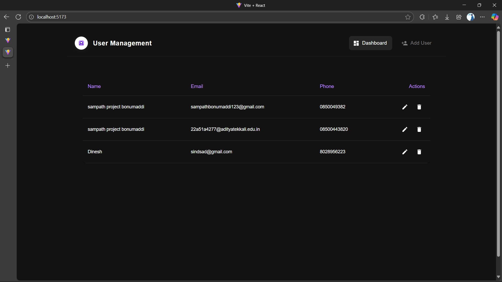
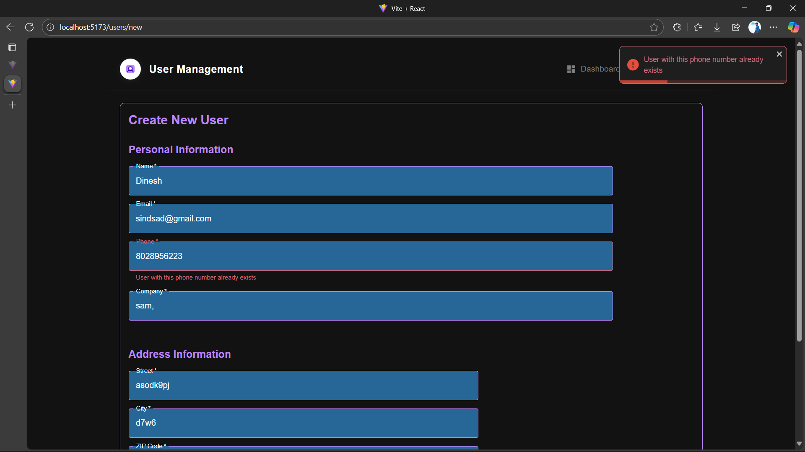
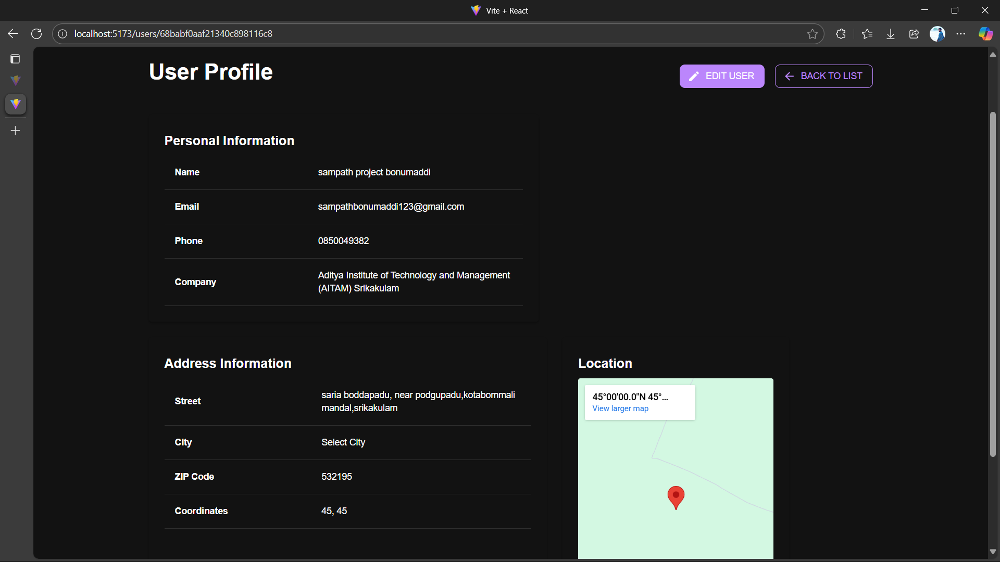
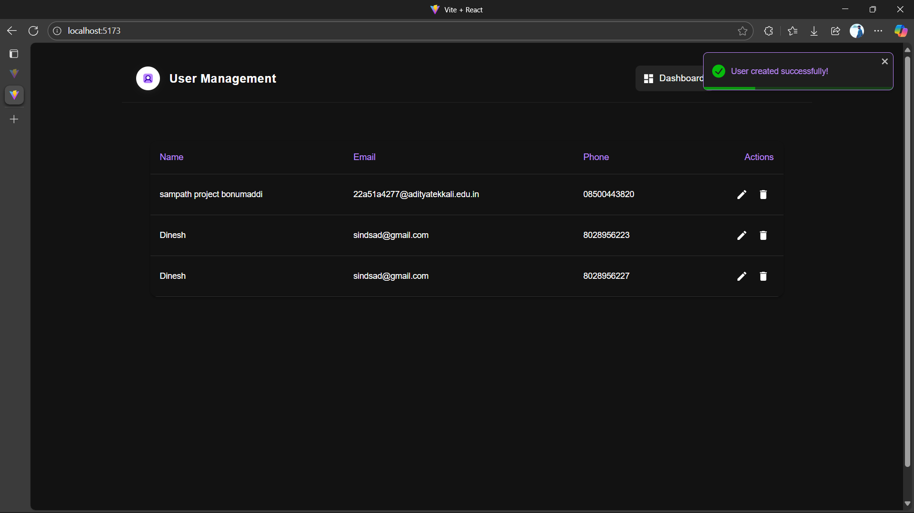

# User Management System

A full-stack user management application built with React, Node.js, and Material-UI featuring a modern, responsive design and comprehensive user management capabilities.

## 🌟 Features

### Dashboard View
- Responsive table layout with progressive disclosure
- Quick access to edit and delete actions
- Real-time updates and toast notifications
- Sortable columns and search functionality

### User Operations
- Create new users with comprehensive form validation
- Edit existing user information
- Delete users with confirmation
- View detailed user profiles

### Responsive Design
- Mobile-first approach
- Adaptive layouts for different screen sizes
- Collapsible table columns on smaller screens
- Touch-friendly interface

### Form Features
- Input validation
- Error handling with visual feedback
- Required field indicators
- Address information with map integration
- Responsive form layout

### Notifications
- Toast notifications for success/error feedback
- Confirmation dialogs for destructive actions
- Error messages with clear instructions
- Success confirmations

## 🛠️ Technologies Used

### Frontend
- React 18
- Vite (Build tool)
- Material-UI (UI Framework)
- React Router v6 (Routing)
- React Toastify (Notifications)
- Axios (API calls)
- Context API (State Management)

### Backend
- Node.js
- Express.js
- MongoDB
- Mongoose
- JWT Authentication
- API Validation

## 📱 Responsive Screenshots

### Dashboard View

- Responsive table layout
- Quick action buttons
- Modern dark theme

### Create User Form

- Clean form layout
- Input validation
- Structured sections

### User Profile

- Detailed user information
- Location mapping
- Edit and back navigation

### Toast Notifications

- Success/Error messages
- Clean design
- Auto-dismiss functionality

## 🚀 Getting Started

### Prerequisites
- Node.js (v14 or higher)
- MongoDB
- npm or yarn

### Installation

1. Clone the repository
```bash
git clone https://github.com/sambgmi/UserManagement.git
```

2. Install Frontend Dependencies
```bash
cd Frontend
npm install
```

3. Install Backend Dependencies
```bash
cd Backend
npm install
```

4. Set up environment variables
```env
PORT=5000
MONGODB_URI=your_mongodb_uri
```

5. Start the development servers

Backend:
```bash
cd Backend
npm run dev
```

Frontend:
```bash
cd Frontend
npm run dev
```

## 📐 Project Structure

```
UserManagement/
├── Frontend/
│   ├── src/
│   │   ├── components/
│   │   │   ├── common/
│   │   │   ├── forms/
│   │   │   └── users/
│   │   ├── context/
│   │   ├── pages/
│   │   ├── services/
│   │   ├── utils/
│   │   └── theme/
│   └── public/
└── Backend/
    ├── src/
    │   ├── controllers/
    │   ├── models/
    │   ├── routes/
    │   ├── middleware/
    │   └── utils/
    └── config/
```

## 🔒 Features

### User Management
- ✅ Create new users
- ✅ Read user information
- ✅ Update user details
- ✅ Delete users
- ✅ User profile view
- ✅ Form validation
- ✅ Error handling

### UI/UX Features
- ✅ Responsive design
- ✅ Dark theme
- ✅ Toast notifications
- ✅ Loading states
- ✅ Error states
-  Confirmation dialogs
-  Input validation
-  Clean navigation

## 🤝 Contributing

1. Fork the Project
2. Create your Feature Branch (`git checkout -b feature/AmazingFeature`)
3. Commit your Changes (`git commit -m 'Add some AmazingFeature'`)
4. Push to the Branch (`git push origin feature/AmazingFeature`)
5. Open a Pull Request

## 📄 License

This project is licensed under the MIT License - see the [LICENSE](LICENSE) file for details

## 🙋‍♂️ Author

Your Name - [GitHub Profile](https://github.com/sambgmi)
